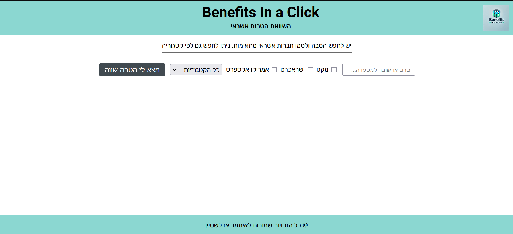
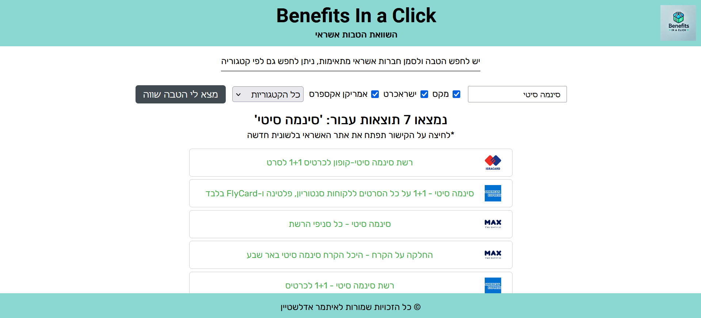
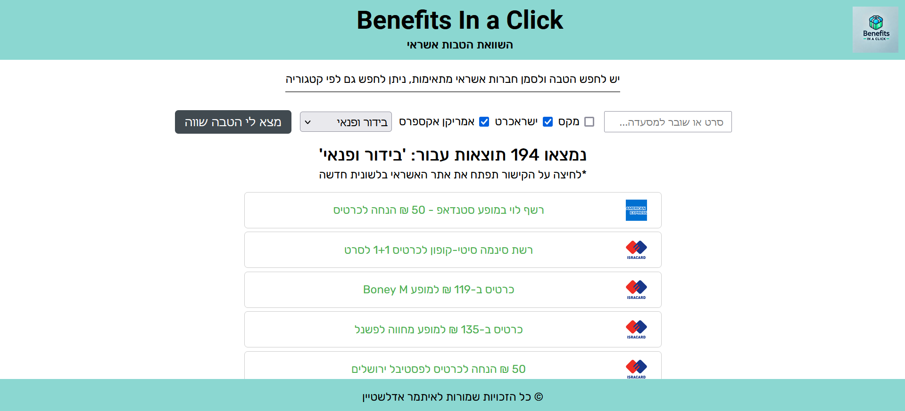

# Benefits In a Click

Benefits in a Click is a user-friendly platform where users can search and compare credit card benefits based on the credit clubs they are members of and help them save money.

## About the Project

The goal of my project is to create a user-friendly platform where users can easily find and compare benefits without the hassle of navigating through multiple websites, saving valuable time and money for them.
In this project, I developed web crawlers to collect information from various credit club websites and built a comprehensive, continuously updated database of benefits.
I also created both the back-end and front-end of the website, ensuring it is easy to use with a sleek modern design.

## Features

- **User-friendly Interface:** Easy to navigate and use.
- **Quick Access to a Variety of Benefits:** Find benefits quickly and easily.
- **Updates Regularly:** The database is constantly being updated with the latest benefits.

## Screenshots

Here are some screenshots of the project:

*Main search page*

*A simple search*

*A search by category*

## To get in touch, please contact me at [ita.edel@pm.me](mailto:ita.edel@pm.me) or connect with me on [LinkedIn](https://www.linkedin.com/in/itamar-edelstein-868897204/).
---

&copy; 2024 Itamar Edelstein. All rights reserved.
